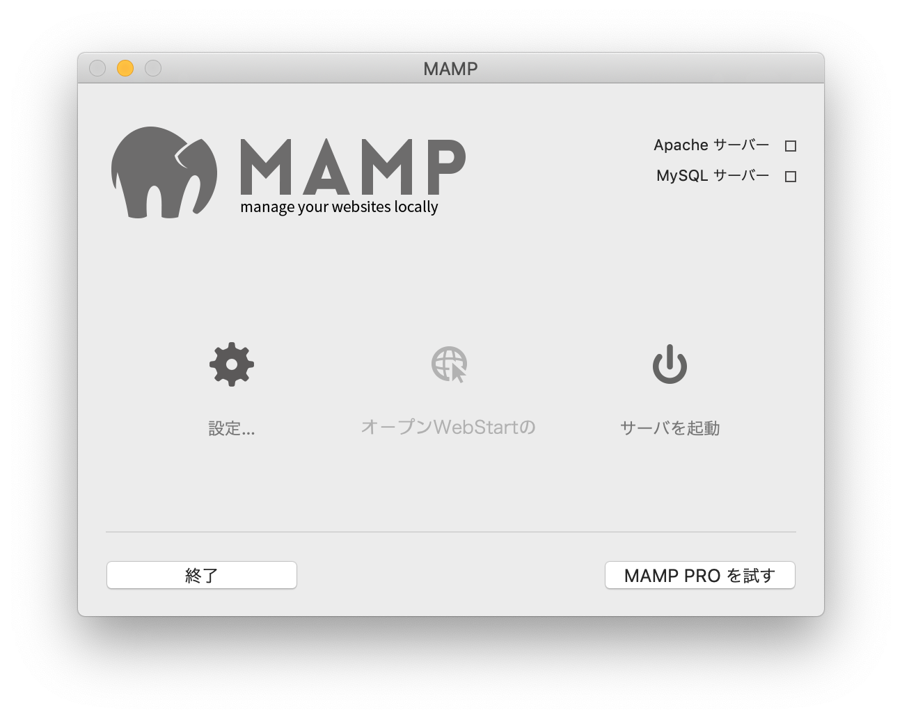
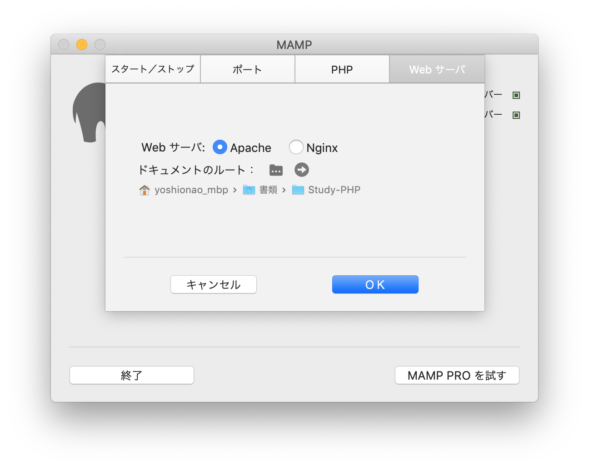
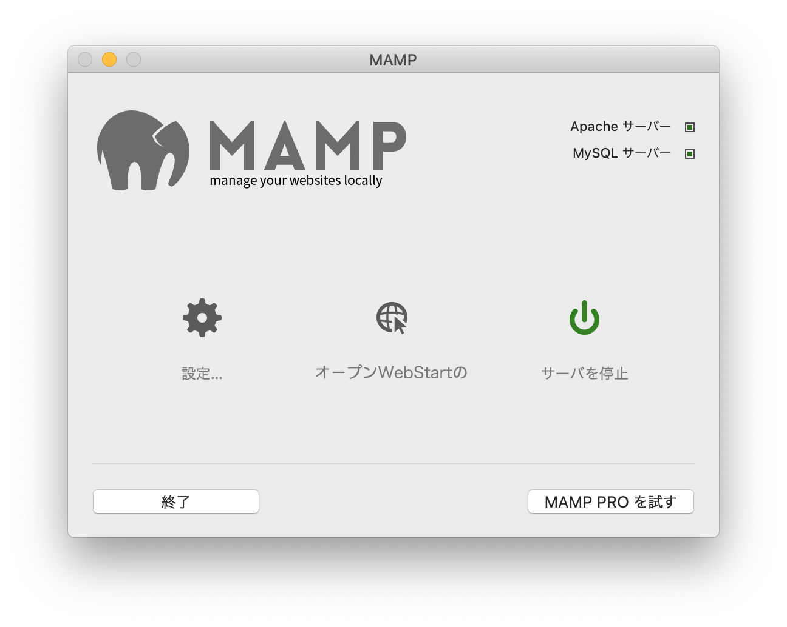

# Study-PHP  

### PHP Develop on MacOS  

MacOS で PHP を書く。  
MAMP.app を使う。  

(1) MAMP の設定  
  

(2) MAMP の起動ディレクトリを設定  
  

(3) サーバのスタート  
  

(4) ブラウザで、ローカルホストにアクセス。  
ポートや、PHP のバージョンも MAMP で設定できる。  

[http://localhost:8888/](http://localhost:8888/)  

---  

